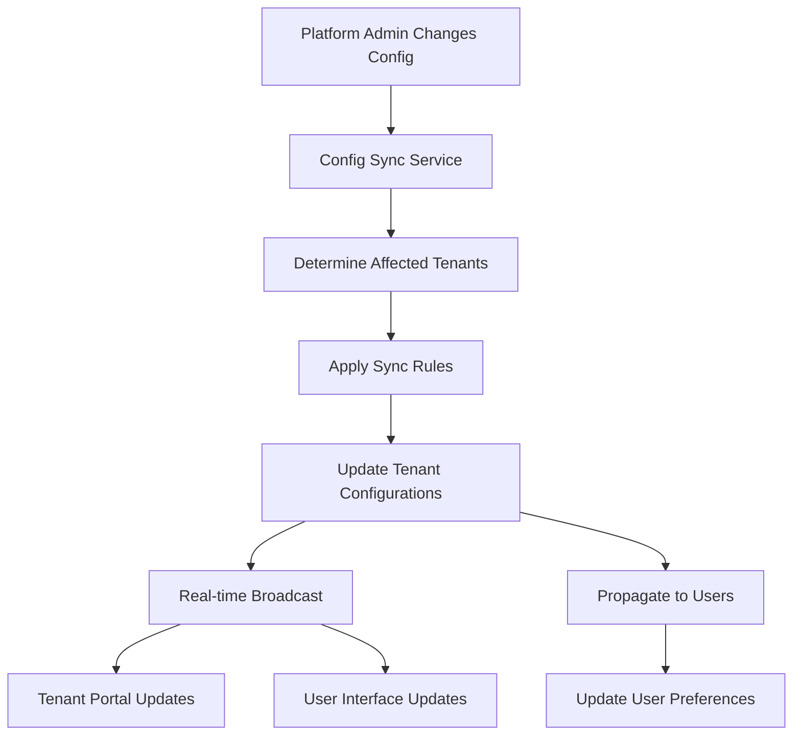
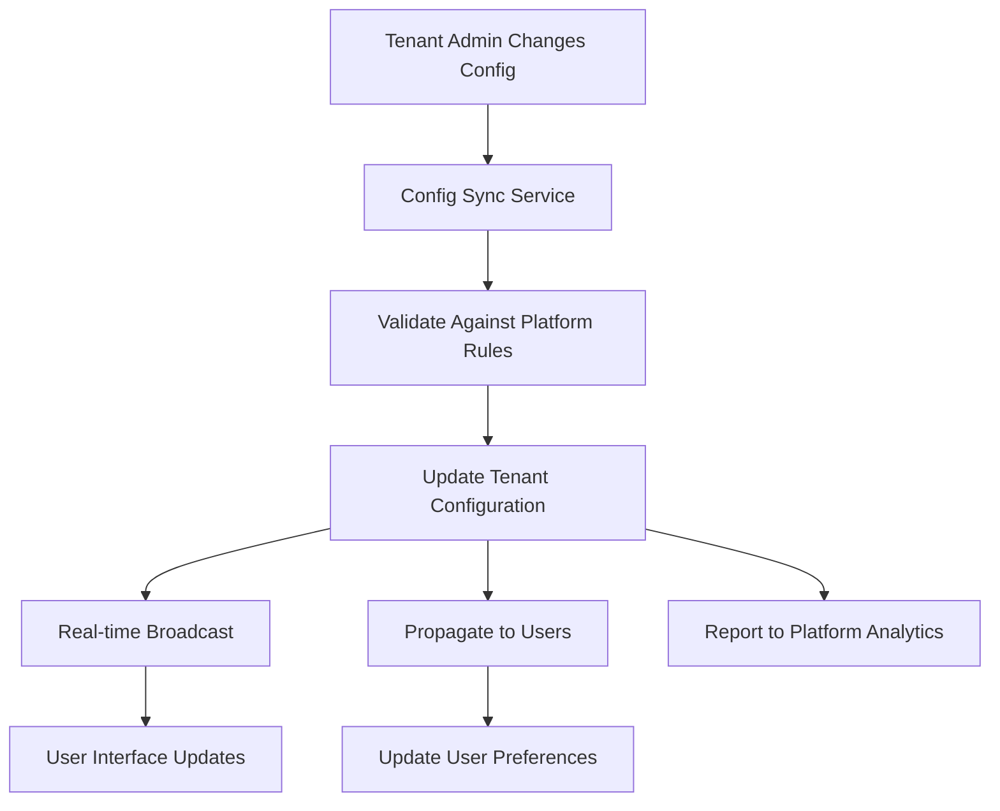

# 🔄 Enterprise Configuration Synchronization Architecture

## Overview

This document outlines the comprehensive bi-directional configuration synchronization system implemented in the SaaS Framework. The system ensures that configuration changes made at any level (Platform Admin, Tenant Admin, or User) are automatically propagated and synchronized across all relevant interfaces.

## 🏗️ Architecture Components

### 1. **Configuration Sync Service** (`server/services/config-sync.ts`)
- **Purpose**: Central orchestrator for all configuration changes
- **Features**:
  - Event-driven synchronization
  - Configurable sync rules
  - Conflict resolution strategies
  - Hierarchical configuration inheritance
  - Automatic change propagation

### 2. **Real-time Communication Service** (`server/services/realtime-sync.ts`)
- **Purpose**: WebSocket-based real-time updates
- **Features**:
  - Socket.IO integration
  - User authentication
  - Room-based targeting (tenant, user, role)
  - Connection management
  - Heartbeat monitoring

### 3. **Client-side Real-time Hook** (`client/src/hooks/use-realtime-sync.ts`)
- **Purpose**: React hook for receiving real-time updates
- **Features**:
  - Automatic query invalidation
  - User notifications
  - Reconnection handling
  - Event-specific handlers

### 4. **Config Sync Dashboard** (`client/src/pages/config-sync-dashboard.tsx`)
- **Purpose**: Administrative interface for monitoring synchronization
- **Features**:
  - Real-time sync status
  - Tenant-level health monitoring
  - Sync event history
  - Connection statistics
  - Manual sync triggers

## 🔄 Synchronization Flow

### Platform Admin → Tenant → User Flow



### Tenant Admin → User Flow



## 📋 Sync Rules Configuration

### Rule Types

1. **Auth/SSO Configuration Sync**
   ```typescript
   {
     triggerEvents: ['auth.provider.create', 'auth.provider.update', 'auth.provider.enable'],
     targetScopes: ['tenant', 'user'],
     syncDirection: 'down', // Platform → Tenant → User
     conflictResolution: 'platform-wins',
     autoApply: true
   }
   ```

2. **RBAC Permission Template Sync**
   ```typescript
   {
     triggerEvents: ['rbac.template.create', 'rbac.template.update'],
     targetScopes: ['tenant'],
     syncDirection: 'down',
     conflictResolution: 'merge', // Merge with existing customizations
     autoApply: true
   }
   ```

3. **Notification Configuration Sync**
   ```typescript
   {
     triggerEvents: ['notifications.config.update', 'notifications.provider.add'],
     targetScopes: ['tenant', 'user'],
     syncDirection: 'down',
     conflictResolution: 'tenant-wins', // Tenant preferences override
     autoApply: true
   }
   ```

### Conflict Resolution Strategies

- **platform-wins**: Platform configuration overrides all local changes
- **tenant-wins**: Tenant configuration takes precedence over platform defaults
- **user-wins**: User preferences are never overridden
- **merge**: Intelligently merge configurations preserving customizations

## 🎯 Synchronization Triggers

### Platform Admin Actions
- ✅ Create/Update Permission Templates → Sync to all tenants
- ✅ Update Business Type Configurations → Update affected tenants
- ✅ Enable/Disable Modules → Update tenant availability
- ✅ Configure Global Auth Providers → Update tenant login options

### Tenant Admin Actions
- ✅ Update RBAC Configuration → Sync to tenant users
- ✅ Configure Notification Providers → Update user preferences
- ✅ Customize Auth Settings → Update login flows
- ✅ Module Configuration Changes → Update user interfaces

### User Actions
- ✅ Update Notification Preferences → Personal settings only
- ✅ Configure MFA Settings → Personal security settings

## 🔄 Real-time Communication

### WebSocket Events

#### Configuration Updates
```typescript
socket.on('config-updated', (update: RealtimeUpdate) => {
  // Handle module-specific configuration changes
  // Auto-invalidate relevant React Query caches
  // Show user notifications
});
```

#### Module Changes
```typescript
socket.on('module-changed', (update: RealtimeUpdate) => {
  // Handle module enable/disable
  // Update navigation and UI elements
  // Refresh feature availability
});
```

#### Authentication Changes
```typescript
socket.on('auth-changed', (update: RealtimeUpdate) => {
  // Update available login providers
  // Handle SSO configuration changes
  // Trigger re-authentication if required
});
```

#### RBAC Changes
```typescript
socket.on('rbac-changed', (update: RealtimeUpdate) => {
  // Update user permissions
  // Refresh role assignments
  // Update UI access controls
});
```

### Room-based Targeting

- **Platform Admins**: `platform:admins`
- **Tenant Admins**: `tenant:{tenantId}:admins`
- **Tenant Users**: `tenant:{tenantId}`
- **Individual Users**: `user:{userId}`
- **Config Subscribers**: `config:{configType}`

## 📊 Monitoring & Analytics

### Real-time Dashboard Features

1. **System Health Overview**
   - Overall synchronization health percentage
   - Total tenants and sync status distribution
   - Live connection statistics

2. **Tenant Status Monitoring**
   - Per-tenant sync status
   - Module-level synchronization state
   - Configuration version tracking
   - Conflict and pending change counts

3. **Sync Event History**
   - Real-time event log
   - Success/failure tracking
   - Performance metrics
   - Error analysis

4. **Live Connection Tracking**
   - Active WebSocket connections
   - Connections by role and tenant
   - Connection health monitoring

### Sync Status Indicators

- 🟢 **Success**: All configurations synchronized
- 🟡 **Partial**: Some configurations have conflicts
- 🔴 **Failed**: Synchronization errors
- 🔵 **Pending**: Changes awaiting synchronization

## 🔧 Implementation Examples

### Platform Admin Updates Permission Template

```typescript
// 1. Platform admin updates template via UI
await updatePermissionTemplate(templateId, newConfig);

// 2. Route triggers sync event
await configSyncService.triggerConfigChange({
  type: 'rbac',
  action: 'update',
  scope: 'platform',
  config: { permissionTemplate: template },
  triggeredBy: 'platform-admin'
});

// 3. Sync service processes change
// 4. All affected tenants receive updates
// 5. Real-time broadcast to connected clients
// 6. UI automatically refreshes
```

### Tenant Admin Configures Notifications

```typescript
// 1. Tenant admin configures SMS provider
await configureSmsProvider(tenantId, smsConfig);

// 2. Route triggers sync event
await configSyncService.triggerConfigChange({
  type: 'notifications',
  action: 'update',
  scope: 'tenant',
  targetId: tenantId,
  config: { smsProvider: smsConfig },
  triggeredBy: userId
});

// 3. Sync service updates user preferences
// 4. Real-time broadcast to tenant users
// 5. Notification preferences UI updates
```

## 🚀 Benefits Achieved

### ✅ **Real-time Synchronization**
- Configuration changes are immediately reflected across all interfaces
- No manual refresh required
- Instant feedback on configuration conflicts

### ✅ **Hierarchical Configuration Management**
- Platform-level defaults cascade to tenants
- Tenant customizations override platform defaults where appropriate
- User preferences always take precedence

### ✅ **Conflict Resolution**
- Intelligent merge strategies prevent data loss
- Clear conflict indicators in admin interfaces
- Manual resolution workflows for complex conflicts

### ✅ **Scalable Architecture**
- Event-driven design supports high tenant volumes
- Room-based WebSocket targeting minimizes bandwidth
- Configurable sync rules adapt to different use cases

### ✅ **Administrative Visibility**
- Real-time monitoring of sync health
- Detailed event logging and analytics
- Proactive alerting for sync failures

### ✅ **User Experience**
- Seamless configuration updates without interruption
- Clear notifications when changes affect users
- Automatic UI refresh with relevant changes

## 🎯 Future Enhancements

1. **Batch Synchronization**: Group related changes for efficiency
2. **Selective Sync**: Allow tenants to opt-out of specific updates
3. **Rollback Capability**: Undo problematic configuration changes
4. **Advanced Conflict Resolution**: AI-assisted conflict resolution
5. **Configuration Versioning**: Track and manage configuration history
6. **Performance Optimization**: Implement delta syncing for large configurations

## 🔐 Security Considerations

- All WebSocket connections require authentication
- Role-based access controls for configuration changes
- Audit logging for all synchronization events
- Encrypted communication channels
- Rate limiting for sync operations

---

This architecture ensures that your multi-tenant SaaS platform maintains configuration consistency while providing the flexibility for tenant-specific customizations. The real-time synchronization capabilities ensure that all users always have access to the most current and appropriate configurations for their context.
