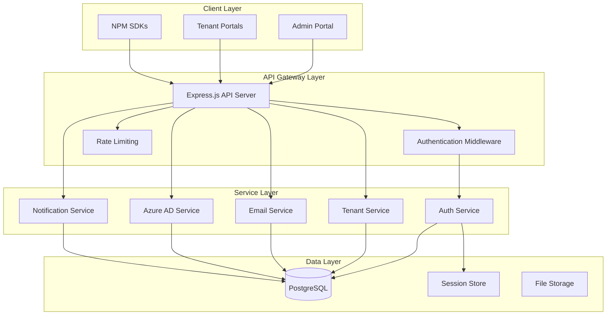
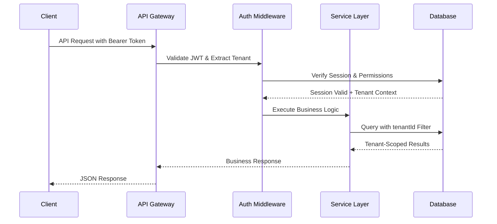
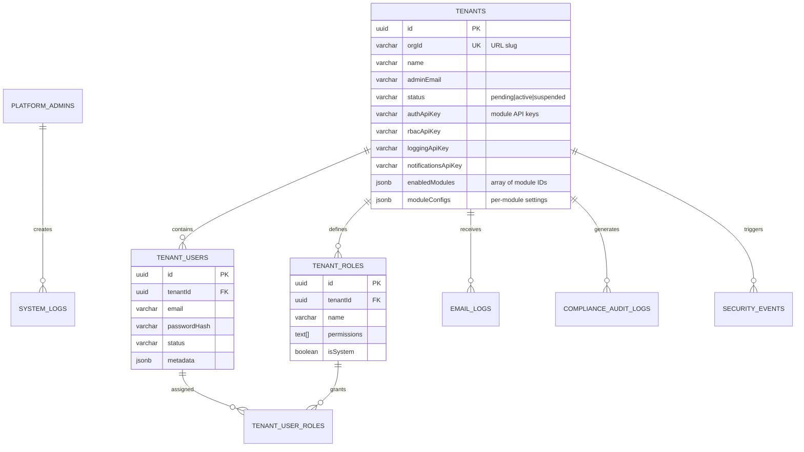
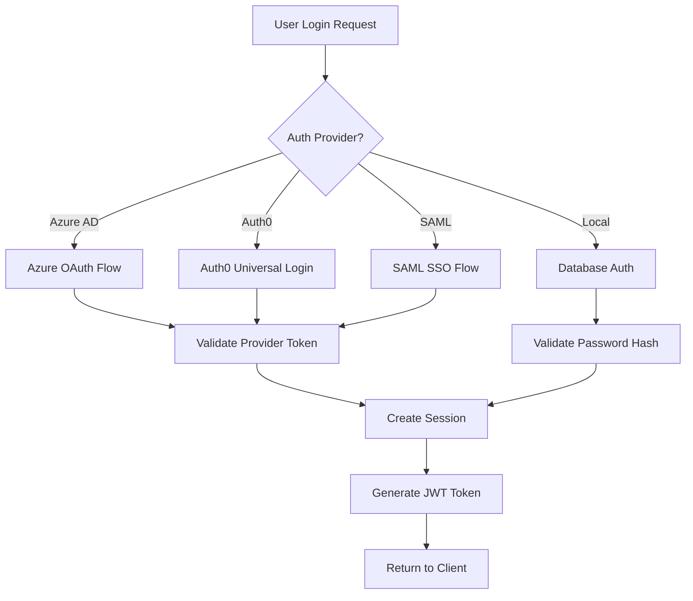
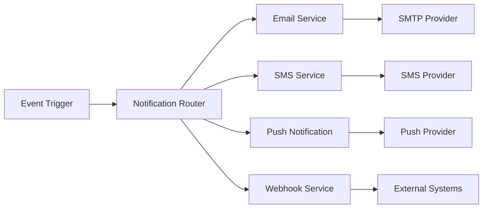
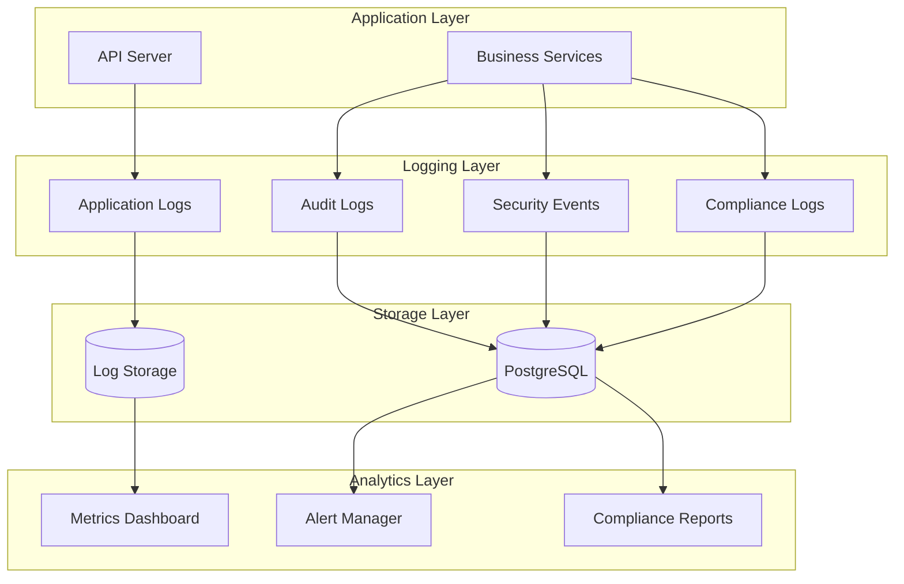
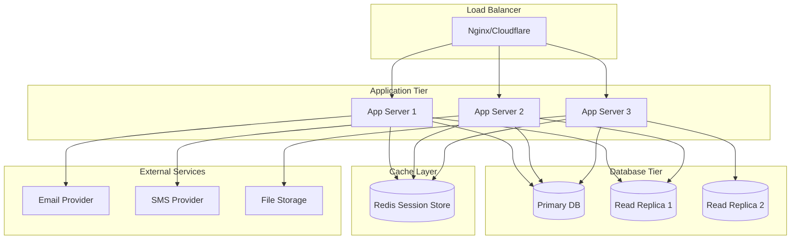

# 🏗️ System Architecture Overview

## 🎯 **High-Level Architecture**



---

## 🏢 **Multi-Tenant Architecture Pattern**

### **Tenant Isolation Strategy:**

```typescript
// Every database operation includes tenantId
const users = await db
  .select()
  .from(tenantUsers)
  .where(eq(tenantUsers.tenantId, currentTenantId));

// API middleware ensures tenant context
app.get("/api/tenants/:tenantId/users", tenantMiddleware, (req, res) => {
  // req.tenant is automatically populated and validated
});
```

### **Database Isolation:**

- **Shared Database, Shared Schema**: All tenants share tables with `tenantId`
  partition key
- **Row-Level Security**: Every query includes tenant context
- **API Key Scoping**: Module-specific API keys prevent cross-tenant access

---

## 🔄 **Request Flow Architecture**

### **Typical API Request Flow:**



### **Security Layers:**

1. **Rate Limiting**: Prevent abuse at network level
2. **JWT Validation**: Verify token authenticity and expiration
3. **Session Verification**: Check active session in database
4. **Tenant Context**: Ensure user belongs to requested tenant
5. **Permission Check**: Verify RBAC permissions for operation
6. **Data Filtering**: Apply tenant-scoped database queries

---

## 🎛️ **Module Architecture**

### **Module Registration Pattern:**

```typescript
interface ModuleDefinition {
  id: string; // "auth", "rbac", "logging"
  name: string; // "Authentication"
  dependencies: string[]; // ["auth"] for rbac
  isRequired: boolean; // true for auth/rbac
  configSchema: ZodSchema; // Validation for module config
  apiRoutes: RouteDefinition[]; // Module-specific endpoints
}
```

### **Module Lifecycle:**

1. **Registration**: Module defines its capabilities and dependencies
2. **Tenant Enablement**: Tenant selects modules during onboarding
3. **API Key Generation**: Unique keys generated per module per tenant
4. **Configuration**: Module-specific settings stored in `moduleConfigs`
5. **Runtime**: Middleware validates API keys and loads module context

---

## 📊 **Database Schema Architecture**

### **Core Entity Relationships:**



### **Key Schema Design Principles:**

1. **Tenant Partitioning**: Every multi-tenant table has `tenantId` foreign key
2. **Module Flexibility**: `enabledModules` array and `moduleConfigs` JSONB for
   dynamic configuration
3. **Audit Trail**: Comprehensive logging tables for compliance
4. **Security Events**: Real-time threat detection and monitoring
5. **Type Safety**: Drizzle ORM provides full TypeScript integration

---

## 🔐 **Authentication & Authorization Architecture**

### **Multi-Provider Authentication Flow:**



### **RBAC Permission System:**

```typescript
// Hierarchical permission structure
interface Permission {
  id: string; // "users.create"
  resource: string; // "users"
  action: string; // "create"
  scope: string; // "tenant" | "global"
  conditions?: object; // Dynamic conditions
}

// Role-based access control
interface Role {
  id: string;
  name: string;
  permissions: Permission[];
  inheritFrom?: string[]; // Role hierarchy
}

// Runtime permission check
const hasPermission = await rbac.check(userId, "users.create", {
  tenantId: currentTenant.id,
  resourceId: targetUserId,
});
```

---

## 📧 **Email & Notification Architecture**

### **Multi-Channel Notification System:**



### **Template System:**

- **Dynamic Templates**: Jinja-style templating with tenant data
- **Multi-Channel**: Same template rendered for email, SMS, push
- **Localization**: Support for multiple languages per tenant
- **A/B Testing**: Template variants for optimization

---

## 🔍 **Monitoring & Logging Architecture**

### **Observability Stack:**



### **Compliance Logging:**

- **GDPR**: Data access, modification, deletion tracking
- **SOX**: Financial data access and modification audits
- **HIPAA**: Healthcare data access and privacy controls
- **PCI**: Payment card data handling and access logs

---

## 🚀 **Deployment Architecture**

### **Production Deployment Stack:**



### **Scalability Considerations:**

- **Horizontal Scaling**: Stateless application servers
- **Database Sharding**: Partition by tenant for massive scale
- **CDN Integration**: Static asset delivery and API caching
- **Container Ready**: Docker support for easy deployment
- **Health Checks**: Built-in monitoring and auto-recovery
