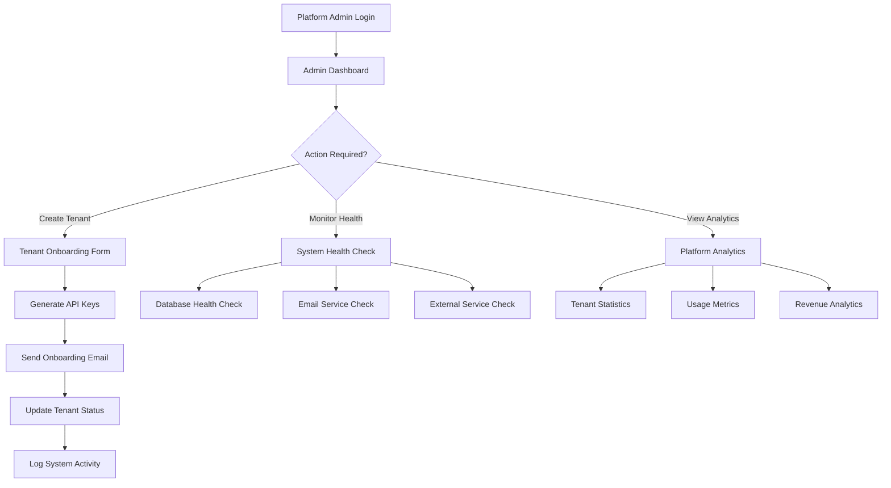
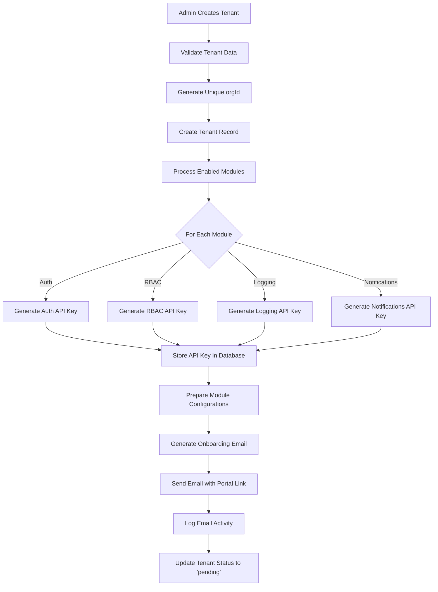
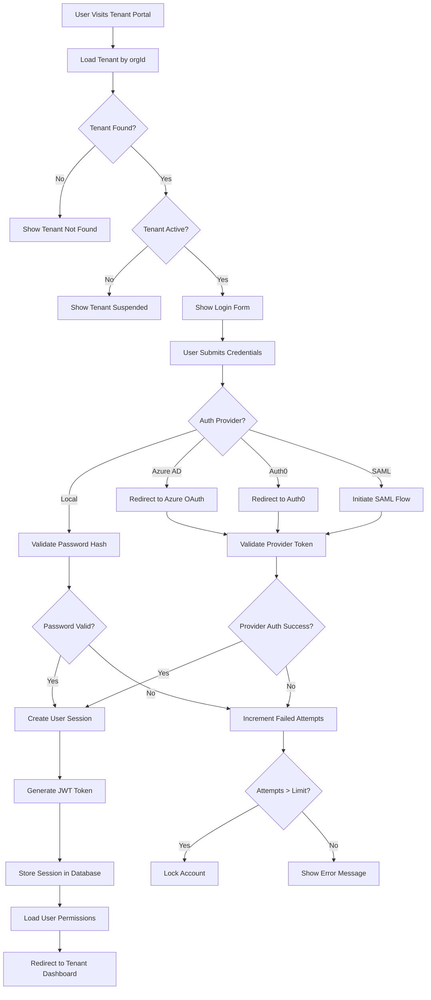

# 🏭 Business Logic & Core Workflows

## 🎯 **Core Business Processes**

### **1. Platform Admin Workflow:**



### **2. Tenant Onboarding Workflow:**



### **3. Tenant User Login Workflow:**



---

## 🔐 **Authentication Business Logic**

### **Multi-Provider Authentication Strategy:**

```typescript
class AuthenticationService {
  async authenticateUser(credentials: LoginCredentials, tenantId: string) {
    // 1. Load tenant configuration
    const tenant = await this.getTenantWithConfig(tenantId);

    // 2. Determine authentication provider
    const providers = tenant.moduleConfigs.auth?.providers || [];
    const primaryProvider = providers.find(p => p.priority === 1);

    // 3. Route to appropriate authentication method
    switch (primaryProvider?.type) {
      case "azure-ad":
        return this.authenticateWithAzureAD(
          credentials,
          primaryProvider.config
        );
      case "auth0":
        return this.authenticateWithAuth0(credentials, primaryProvider.config);
      case "saml":
        return this.authenticateWithSAML(credentials, primaryProvider.config);
      default:
        return this.authenticateWithLocal(credentials, tenantId);
    }
  }

  async createUserSession(user: TenantUser, tenantId: string) {
    // 1. Generate JWT token
    const token = this.generateJWT({
      userId: user.id,
      tenantId: tenantId,
      email: user.email,
      permissions: await this.getUserPermissions(user.id, tenantId),
    });

    // 2. Store session in database
    const session = await this.storage.createSession({
      tenantId,
      userId: user.id,
      token,
      expiresAt: new Date(Date.now() + this.sessionTimeout),
    });

    // 3. Update user last login
    await this.storage.updateUserLastLogin(user.id);

    // 4. Log authentication event
    await this.logAuthenticationEvent(user.id, tenantId, "login_success");

    return { token, session };
  }
}
```

### **Session Management Logic:**

```typescript
class SessionManager {
  async validateSession(token: string): Promise<SessionContext | null> {
    // 1. Verify JWT signature and expiration
    const payload = this.verifyJWT(token);
    if (!payload) return null;

    // 2. Check session exists in database
    const session = await this.storage.getSession(token);
    if (!session || session.expiresAt < new Date()) {
      await this.storage.deleteSession(token);
      return null;
    }

    // 3. Load current user and tenant data
    const user = await this.storage.getTenantUser(payload.userId);
    const tenant = await this.storage.getTenant(payload.tenantId);

    if (
      !user ||
      !tenant ||
      user.status !== "active" ||
      tenant.status !== "active"
    ) {
      await this.storage.deleteSession(token);
      return null;
    }

    // 4. Refresh permissions (in case roles changed)
    const permissions = await this.rbac.getUserPermissions(user.id, tenant.id);

    return {
      user,
      tenant,
      permissions,
      sessionId: session.id,
    };
  }
}
```

---

## 👥 **RBAC Business Logic**

### **Permission Checking System:**

```typescript
class RBACService {
  async checkPermission(
    userId: string,
    tenantId: string,
    permission: string,
    resourceContext?: any
  ): Promise<boolean> {
    // 1. Get user's roles
    const userRoles = await this.storage.getUserRoles(userId, tenantId);

    // 2. Collect all permissions from roles
    const allPermissions = new Set<string>();

    for (const role of userRoles) {
      for (const perm of role.permissions) {
        // Handle wildcard permissions
        if (perm === "*") {
          return true; // Super admin
        }

        // Handle pattern permissions (e.g., "users.*")
        if (perm.endsWith(".*") && permission.startsWith(perm.slice(0, -1))) {
          return true;
        }

        allPermissions.add(perm);
      }
    }

    // 3. Check exact permission match
    if (allPermissions.has(permission)) {
      return true;
    }

    // 4. Check contextual permissions
    if (resourceContext) {
      return this.checkContextualPermission(
        userId,
        permission,
        resourceContext,
        allPermissions
      );
    }

    return false;
  }

  async assignRoleToUser(
    userId: string,
    roleId: string,
    tenantId: string,
    assignedBy: string
  ) {
    // 1. Validate role exists and belongs to tenant
    const role = await this.storage.getRole(roleId, tenantId);
    if (!role) {
      throw new Error("Role not found");
    }

    // 2. Check if assignment already exists
    const existingAssignment = await this.storage.getUserRoleAssignment(
      userId,
      roleId
    );
    if (existingAssignment) {
      throw new Error("User already has this role");
    }

    // 3. Create role assignment
    const assignment = await this.storage.createUserRoleAssignment({
      tenantId,
      userId,
      roleId,
      assignedBy,
    });

    // 4. Log RBAC change for compliance
    await this.auditService.logComplianceEvent({
      tenantId,
      eventType: "rbac_change",
      action: "role_assigned",
      entityType: "user",
      entityId: userId,
      details: {
        roleId,
        roleName: role.name,
        assignedBy,
      },
      complianceFrameworks: ["sox", "gdpr"],
    });

    // 5. Invalidate user's cached permissions
    await this.cache.deleteUserPermissions(userId);

    return assignment;
  }
}
```

### **Dynamic Role Creation:**

```typescript
class RoleManagementService {
  async createCustomRole(
    tenantId: string,
    roleData: CreateRoleRequest,
    createdBy: string
  ) {
    // 1. Validate permissions against tenant's allowed permissions
    const tenantConfig = await this.getTenantConfig(tenantId);
    const allowedPermissions =
      tenantConfig.rbac?.allowedPermissions || this.getDefaultPermissions();

    const invalidPermissions = roleData.permissions.filter(
      perm => !allowedPermissions.includes(perm) && !perm.endsWith(".*")
    );

    if (invalidPermissions.length > 0) {
      throw new ValidationError(
        `Invalid permissions: ${invalidPermissions.join(", ")}`
      );
    }

    // 2. Check role name uniqueness within tenant
    const existingRole = await this.storage.getRoleByName(
      roleData.name,
      tenantId
    );
    if (existingRole) {
      throw new ConflictError("Role name already exists");
    }

    // 3. Create role
    const role = await this.storage.createRole({
      tenantId,
      name: roleData.name,
      description: roleData.description,
      permissions: roleData.permissions,
      isSystem: false,
    });

    // 4. Log role creation
    await this.auditService.logComplianceEvent({
      tenantId,
      eventType: "rbac_change",
      action: "role_created",
      entityType: "role",
      entityId: role.id,
      details: {
        roleName: role.name,
        permissions: role.permissions,
        createdBy,
      },
    });

    return role;
  }
}
```

---

## 📊 **Module Configuration Logic**

### **Dynamic Module Enablement:**

```typescript
class ModuleConfigurationService {
  async enableModule(
    tenantId: string,
    moduleId: ModuleId,
    config: ModuleConfig
  ) {
    // 1. Validate module dependencies
    const moduleDefinition = this.getModuleDefinition(moduleId);
    const tenant = await this.storage.getTenant(tenantId);

    for (const dependency of moduleDefinition.dependencies || []) {
      if (!tenant.enabledModules.includes(dependency)) {
        throw new Error(
          `Module ${moduleId} requires ${dependency} to be enabled first`
        );
      }
    }

    // 2. Generate module-specific API key
    const apiKey = this.generateAPIKey(tenantId, moduleId);

    // 3. Update tenant configuration
    const updates: Partial<Tenant> = {
      enabledModules: [...tenant.enabledModules, moduleId],
      moduleConfigs: {
        ...tenant.moduleConfigs,
        [moduleId]: config,
      },
    };

    // Set the appropriate API key field
    updates[`${moduleId}ApiKey`] = apiKey;

    await this.storage.updateTenant(tenantId, updates);

    // 4. Initialize module-specific resources
    await this.initializeModuleResources(tenantId, moduleId, config);

    // 5. Send notification to tenant admin
    await this.notificationService.sendModuleEnabledNotification(
      tenantId,
      moduleId
    );

    // 6. Log system activity
    await this.auditService.logSystemActivity({
      tenantId,
      action: "module_enabled",
      entityType: "module",
      entityId: moduleId,
      details: { config },
    });

    return { apiKey, moduleId, enabled: true };
  }

  async updateModuleConfig(
    tenantId: string,
    moduleId: ModuleId,
    newConfig: ModuleConfig
  ) {
    // 1. Validate tenant has module enabled
    const tenant = await this.storage.getTenant(tenantId);
    if (!tenant.enabledModules.includes(moduleId)) {
      throw new Error(`Module ${moduleId} is not enabled for this tenant`);
    }

    // 2. Validate configuration against schema
    const moduleDefinition = this.getModuleDefinition(moduleId);
    const validationResult = moduleDefinition.configSchema.safeParse(newConfig);
    if (!validationResult.success) {
      throw new ValidationError(
        "Invalid module configuration",
        validationResult.error
      );
    }

    // 3. Store configuration change audit
    const oldConfig = tenant.moduleConfigs[moduleId];

    // 4. Update configuration
    await this.storage.updateTenantModuleConfig(tenantId, moduleId, newConfig);

    // 5. Apply configuration changes
    await this.applyModuleConfigChanges(
      tenantId,
      moduleId,
      oldConfig,
      newConfig
    );

    // 6. Log configuration change
    await this.auditService.logComplianceEvent({
      tenantId,
      eventType: "config_change",
      action: "module_config_updated",
      entityType: "module",
      entityId: moduleId,
      beforeState: oldConfig,
      afterState: newConfig,
    });

    return { moduleId, config: newConfig };
  }
}
```

---

## 📧 **Email & Notification Logic**

### **Onboarding Email Generation:**

```typescript
class EmailService {
  async sendTenantOnboardingEmail(tenant: Tenant) {
    // 1. Generate secure portal access link
    const portalUrl = `${this.config.baseUrl}/tenant/${tenant.orgId}/login`;

    // 2. Prepare API key information for enabled modules
    const apiKeyInfo = this.buildAPIKeyInfo(tenant);

    // 3. Generate email content
    const emailContent = await this.renderTemplate("tenant_onboarding", {
      tenantName: tenant.name,
      orgId: tenant.orgId,
      portalUrl,
      apiKeys: apiKeyInfo,
      enabledModules: tenant.enabledModules,
      supportEmail: this.config.supportEmail,
      documentationUrl: `${this.config.baseUrl}/docs`,
    });

    // 4. Send email
    const result = await this.smtpService.sendEmail({
      to: tenant.adminEmail,
      subject: `Welcome to ${this.config.platformName} - Your SaaS Platform is Ready`,
      html: emailContent.html,
      text: emailContent.text,
    });

    // 5. Log email activity
    await this.storage.logEmail({
      tenantId: tenant.id,
      recipientEmail: tenant.adminEmail,
      subject: result.subject,
      templateType: "tenant_onboarding",
      status: result.success ? "sent" : "failed",
      errorMessage: result.error,
    });

    return result;
  }

  private buildAPIKeyInfo(tenant: Tenant) {
    const apiKeys = [];

    for (const moduleId of tenant.enabledModules) {
      const apiKeyField = `${moduleId}ApiKey`;
      const apiKey = tenant[apiKeyField];

      if (apiKey) {
        apiKeys.push({
          module: moduleId,
          key: apiKey,
          description: this.getModuleDescription(moduleId),
        });
      }
    }

    return apiKeys;
  }
}
```

### **Event-Driven Notifications:**

```typescript
class NotificationOrchestrator {
  async processSystemEvent(event: SystemEvent) {
    switch (event.type) {
      case "tenant_created":
        await this.handleTenantCreated(event);
        break;
      case "user_login_failed":
        await this.handleFailedLogin(event);
        break;
      case "security_threshold_exceeded":
        await this.handleSecurityAlert(event);
        break;
      case "module_enabled":
        await this.handleModuleEnabled(event);
        break;
    }
  }

  private async handleSecurityAlert(event: SecurityEvent) {
    // 1. Determine alert severity and recipients
    const tenant = await this.storage.getTenant(event.tenantId);
    const alertConfig = tenant.moduleConfigs.logging?.alertThresholds;

    // 2. Check if alert threshold is met
    const recentEvents = await this.storage.getSecurityEvents(
      event.tenantId,
      event.eventType,
      { hours: 1 }
    );

    const threshold = alertConfig?.find(t => t.eventType === event.eventType);
    if (!threshold || recentEvents.length < threshold.count) {
      return; // Threshold not met
    }

    // 3. Send alert notifications
    await this.emailService.sendSecurityAlert({
      tenant,
      eventType: event.eventType,
      severity: threshold.severity,
      eventCount: recentEvents.length,
      timeWindow: "1 hour",
    });

    // 4. Create in-app notification
    await this.storage.createTenantNotification({
      tenantId: event.tenantId,
      type: "security_alert",
      title: `Security Alert: ${event.eventType}`,
      message: `${recentEvents.length} ${event.eventType} events detected in the last hour`,
      metadata: {
        severity: threshold.severity,
        eventType: event.eventType,
        eventCount: recentEvents.length,
      },
    });
  }
}
```

---

## 🔍 **Audit & Compliance Logic**

### **Comprehensive Audit Trail:**

```typescript
class ComplianceAuditService {
  async logComplianceEvent(event: ComplianceEventData) {
    // 1. Determine applicable compliance frameworks
    const tenant = await this.storage.getTenant(event.tenantId);
    const frameworks = this.determineComplianceFrameworks(tenant, event);

    // 2. Calculate risk level based on event type and data classification
    const riskLevel = this.calculateRiskLevel(event);

    // 3. Enhance event data with metadata
    const enhancedEvent = {
      ...event,
      complianceFrameworks: frameworks,
      riskLevel,
      dataClassification: this.classifyData(event),
      retentionUntil: this.calculateRetentionDate(frameworks),
    };

    // 4. Store audit log
    await this.storage.createComplianceAuditLog(enhancedEvent);

    // 5. Check for compliance violations
    await this.checkComplianceViolations(enhancedEvent);

    // 6. Generate real-time compliance alerts if needed
    if (riskLevel === "critical" || riskLevel === "high") {
      await this.triggerComplianceAlert(enhancedEvent);
    }
  }

  private determineComplianceFrameworks(
    tenant: Tenant,
    event: ComplianceEventData
  ): string[] {
    const frameworks = [];

    // GDPR applies to all EU data processing
    if (this.isGDPRApplicable(tenant, event)) {
      frameworks.push("gdpr");
    }

    // SOX applies to financial data access
    if (this.isSOXApplicable(tenant, event)) {
      frameworks.push("sox");
    }

    // HIPAA applies to healthcare data
    if (this.isHIPAAApplicable(tenant, event)) {
      frameworks.push("hipaa");
    }

    return frameworks;
  }

  async generateComplianceReport(
    tenantId: string,
    framework: string,
    period: DateRange
  ) {
    // 1. Query compliance audit logs for period
    const auditLogs = await this.storage.getComplianceAuditLogs({
      tenantId,
      complianceFrameworks: [framework],
      startDate: period.start,
      endDate: period.end,
    });

    // 2. Analyze compliance posture
    const analysis = this.analyzeCompliancePosture(auditLogs, framework);

    // 3. Generate recommendations
    const recommendations = this.generateComplianceRecommendations(analysis);

    // 4. Create report document
    const report = {
      tenantId,
      framework,
      period,
      summary: analysis.summary,
      violations: analysis.violations,
      riskAssessment: analysis.riskAssessment,
      recommendations,
      generatedAt: new Date(),
    };

    return report;
  }
}
```

---

## 🎛️ **API Key Management Logic**

### **Secure API Key Generation:**

```typescript
class APIKeyManager {
  generateAPIKey(tenantId: string, moduleId: ModuleId): string {
    // 1. Create deterministic prefix
    const prefix = `saas_${moduleId}_${tenantId.slice(0, 8)}`;

    // 2. Generate cryptographically secure random component
    const randomBytes = crypto.randomBytes(32);
    const randomComponent = randomBytes
      .toString("base64")
      .replace(/[+/=]/g, "")
      .slice(0, 32);

    // 3. Add checksum for validation
    const payload = `${prefix}_${randomComponent}`;
    const checksum = crypto
      .createHash("sha256")
      .update(payload)
      .digest("hex")
      .slice(0, 8);

    return `${payload}_${checksum}`;
  }

  validateAPIKey(apiKey: string, expectedModuleId: ModuleId): boolean {
    // 1. Parse key components
    const parts = apiKey.split("_");
    if (parts.length !== 5 || parts[0] !== "saas") return false;

    const [prefix, moduleId, tenantPrefix, randomComponent, checksum] = parts;

    // 2. Verify module ID matches
    if (moduleId !== expectedModuleId) return false;

    // 3. Verify checksum
    const payload = `${prefix}_${moduleId}_${tenantPrefix}_${randomComponent}`;
    const expectedChecksum = crypto
      .createHash("sha256")
      .update(payload)
      .digest("hex")
      .slice(0, 8);

    return checksum === expectedChecksum;
  }

  async rotateAPIKey(tenantId: string, moduleId: ModuleId, rotatedBy: string) {
    // 1. Generate new API key
    const newApiKey = this.generateAPIKey(tenantId, moduleId);

    // 2. Update tenant record
    const updateField = `${moduleId}ApiKey`;
    await this.storage.updateTenant(tenantId, {
      [updateField]: newApiKey,
    });

    // 3. Log key rotation for security audit
    await this.auditService.logSecurityEvent({
      tenantId,
      eventType: "api_key_rotated",
      severity: "info",
      source: "system",
      details: {
        moduleId,
        rotatedBy,
        keyPrefix: newApiKey.slice(0, 20) + "...",
      },
    });

    // 4. Notify tenant admin
    await this.notificationService.sendAPIKeyRotationNotification(
      tenantId,
      moduleId,
      newApiKey
    );

    return newApiKey;
  }
}
```

This business logic documentation captures the essential workflows and
decision-making processes that drive the SaaS framework, providing clear
understanding of how the system operates and makes decisions across all major
functional areas.
